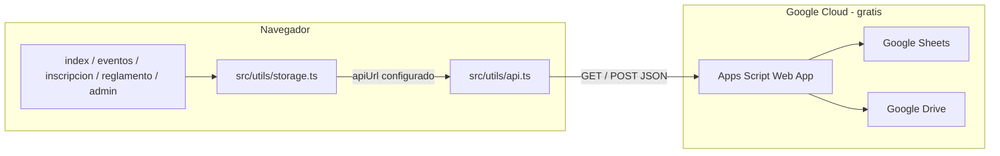

# Minicross Colombia 2026

Plataforma web del **Campeonato Junior Minicross Colombia 2026**: portal de inscripciones, eventos, reglamento oficial y panel de gestión para la organización. Desarrollada con **Vite, TypeScript y Tailwind CSS**, publicada en **GitHub Pages** (CDN global) y respaldada por un backend **serverless** en Google Workspace (Sheets, Apps Script y Drive)—alto rendimiento, sin infraestructura que mantener ni costos recurrentes de hosting.

## Tabla de contenidos

- [Funcionalidades](#funcionalidades)
- [Tecnologías](#tecnologías)
- [Arquitectura](#arquitectura)
- [Estructura del proyecto](#estructura-del-proyecto)
- [Páginas](#páginas)
- [Almacenamiento de datos](#almacenamiento-de-datos)
- [Configuración](#configuración)
- [Desarrollo y despliegue](#desarrollo-y-despliegue)
- [Categorías por edad](#categorías-por-edad)
- [Manual de marca](#manual-de-marca)
- [Documentación adicional](#documentación-adicional)

## Funcionalidades

### Sitio público

| Área | Detalle |
|------|---------|
| **Inicio** | Presentación del campeonato, categorías, CTA a eventos e inscripción |
| **Eventos** | Listado de todos los eventos; estado de inscripciones; enlaces a inscribirse, reglamento por evento (PDF) y resultados (si el evento está finalizado) |
| **Inscripción** | Formulario completo: datos del piloto, fecha de nacimiento con cálculo de edad, categorías múltiples según edad, número de piloto (lista en tiempo real), documento de identidad y comprobante de pago (foto/PDF) |
| **Reglamento** | Contenido oficial del campeonato (19 secciones), índice navegable y descarga del PDF |
| **Resultados** | Página habilitada cuando un evento se marca como finalizado (estructura lista para conectar datos) |

### Validaciones de inscripción

- Edad calculada desde fecha de nacimiento; categorías filtradas automáticamente
- Reglas de categorías por edad (puedes inscribirte en todas las categorías válidas para tu edad)
- Números de piloto del **4 al 999**, únicos por evento
- Al enviar, el backend rechaza números ya tomados con mensaje de error claro
- Archivos con límite de tamaño configurable (`maxFileSizeMB` en `src/config.ts`)

### Panel de administración (ruta oculta)

> **`/panel-minicross-gestion-2026.html`** — contraseña en `src/config.ts` (`adminPassword`)

- Inscripciones agrupadas por evento (pestañas)
- Ver, editar y eliminar inscripciones (con confirmación SweetAlert2)
- Enlaces a documento de identidad y comprobante de pago (Google Drive cuando hay API)
- Gestión de eventos: crear, editar, activar/desactivar inscripciones, marcar como finalizado
- Subida de reglamento PDF por evento (guardado en Drive vía Apps Script)
- Exportar / importar datos JSON (modo local o respaldo)

## Tecnologías

| Capa | Stack |
|------|--------|
| **Frontend** | HTML multi-página, TypeScript, Vite 6 |
| **Estilos** | Tailwind CSS 3, CSS personalizado (manual de marca) |
| **UI** | SweetAlert2 (alertas y confirmaciones) |
| **Tipografías** | Bebas Neue, Montserrat (Google Fonts) |
| **Backend (producción)** | Google Sheets + Google Apps Script + Google Drive |
| **Hosting** | GitHub Pages (sitio estático en `dist/`) |
| **CI/CD** | GitHub Actions (`.github/workflows/deploy.yml`) |

No hay base de datos ni servidor Node en producción: todo el sitio compilado es estático; la lógica de datos vive en Apps Script.

## Arquitectura



### Flujo de una inscripción (modo producción)

1. El piloto abre `inscripcion.html` y elige un evento activo.
2. El frontend consulta números disponibles (`action=availablePilots`) contra la Sheet.
3. Al enviar, `createRegistration` valida categorías y envía el registro a la Web App.
4. Apps Script comprueba de nuevo que el número de piloto esté libre, sube archivos a Drive y añade la fila en `Registrations`.
5. El admin ve los datos al instante en el panel.

### Modo local (desarrollo)

Si `apiUrl` está vacío en `src/config.ts`, los datos se guardan en **localStorage** del navegador. Útil para pruebas; no sirve para inscripciones concurrentes reales.

## Estructura del proyecto

```
├── index.html / eventos.html / inscripcion.html / reglamento.html / resultados.html
├── panel-minicross-gestion-2026.html   # Admin (no enlazado en menú público)
├── src/
│   ├── main.ts, eventos-main.ts, inscripcion-main.ts, reglamento-main.ts, …
│   ├── pages/          # Lógica por página (home, events, registration, admin, …)
│   ├── components/     # navbar, etc.
│   ├── content/        # reglamento-sections.ts (texto oficial)
│   ├── utils/          # api.ts, storage.ts, age.ts
│   ├── types/          # Event, Registration, categorías
│   ├── styles/main.css # Tailwind + tokens de marca
│   └── config.ts       # apiUrl, contraseña admin, límites
├── docs/
│   ├── google-apps-script.gs   # Backend completo
│   ├── SETUP-GOOGLE-SHEETS.md  # Guía de configuración
│   └── ENCODING.md
├── public/             # logo, PDF reglamento, data de ejemplo
└── scripts/            # UTF-8, parches, git hooks
```

## Páginas

| Página | Archivo | Entrada TS |
|--------|---------|------------|
| Inicio | `index.html` | `src/main.ts` |
| Eventos | `eventos.html` | `src/eventos-main.ts` |
| Inscripción | `inscripcion.html` | `src/inscripcion-main.ts` |
| Reglamento | `reglamento.html` | `src/reglamento-main.ts` |
| Resultados | `resultados.html` | `src/resultados-main.ts` |
| Admin | `panel-minicross-gestion-2026.html` | `src/admin-main.ts` |

Menú público: Inicio · Eventos · Inscripción · Reglamento.

## Almacenamiento de datos

### Producción recomendada: Google Sheets

| Acción | Comportamiento |
|--------|----------------|
| Listar números de piloto | Consulta en tiempo real a la hoja |
| Crear inscripción | Validación de número + fila nueva en `Registrations` |
| Documento / comprobante | Base64 → Google Drive; URL guardada en la Sheet |
| Admin | CRUD de eventos e inscripciones vía la misma Web App |

Guía completa: **[docs/SETUP-GOOGLE-SHEETS.md](docs/SETUP-GOOGLE-SHEETS.md)**

Pestañas en la Sheet: **`Events`**, **`Registrations`**. El script incluye utilidades `repairAllSheets` / `repairRegistrationsSheet` para alinear columnas si la hoja se desordenó.

### Modo local

- `apiUrl` vacío → `localStorage` + export/import JSON desde el panel
- Sin validación centralizada entre dispositivos

## Configuración

Edita `src/config.ts`:

```ts
export const CONFIG = {
  adminPassword: 'minicross2026',  // cambiar en producción
  apiUrl: '',                      // URL de la Web App de Apps Script
  spreadsheetUrl: '',              // opcional: enlace directo a la Sheet
  storageKeys: { ... },
  maxFileSizeMB: 5,
};
```

Tras cambiar `apiUrl`, vuelve a ejecutar `npm run build` antes de publicar.

## Desarrollo y despliegue

### Requisitos

- Node.js 20+
- Cuenta Google (para backend en producción)
- Repositorio en GitHub (para Pages)

### Comandos

```bash
npm install
npm run dev          # http://localhost:5173
npm run build        # genera dist/ (verifica UTF-8 antes)
npm run preview      # previsualizar build
npm run check:encoding
npm run fix:encoding # convertir UTF-16 → UTF-8 si hace falta
```

### GitHub Pages

1. `npm run build`
2. Publica la carpeta `dist/` (rama `gh-pages` o workflow incluido)

El workflow **Deploy to GitHub Pages** (`.github/workflows/deploy.yml`) construye y despliega automáticamente en cada push a `main`.

### Codificación UTF-8

Todo el código fuente debe estar en **UTF-8** (`.editorconfig`, `.vscode/settings.json`, hook pre-commit). Detalle: [docs/ENCODING.md](docs/ENCODING.md).

## Categorías por edad

| Categoría | Edad |
|-----------|------|
| 50cc | 4 – 6 años |
| 50cc | 6 – 8 años |
| 65cc | 7 – 9 años |
| 65cc | 8 – 10 años |
| 85cc | 9 – 11 años |
| 85cc | 11 – 13 años |
| 125cc Junior | 12 – 17 años |

Edad mínima: primer día del evento. Edad máxima: cumplida al 1 de enero del año del campeonato (según reglamento).

## Manual de marca

| Token | Valor |
|-------|--------|
| Primary | `#06142B` |
| Secondary | `#00C2FF` |
| Accent | `#FFD400` |
| Orange | `#FF7A00` |
| Títulos | Bebas Neue |
| Cuerpo | Montserrat |

Clases utilitarias: `.btn-primary`, `.btn-secondary`, `.btn-outline`, `.card`, `.section-title`, `.input-field`.

## Documentación adicional

- [Configurar Google Sheets](docs/SETUP-GOOGLE-SHEETS.md)
- [Codificación UTF-8](docs/ENCODING.md)
- Código backend: [docs/google-apps-script.gs](docs/google-apps-script.gs)

## Licencia y créditos

Proyecto privado para **Minicross Colombia 2026** / Cogua Moto Park.
